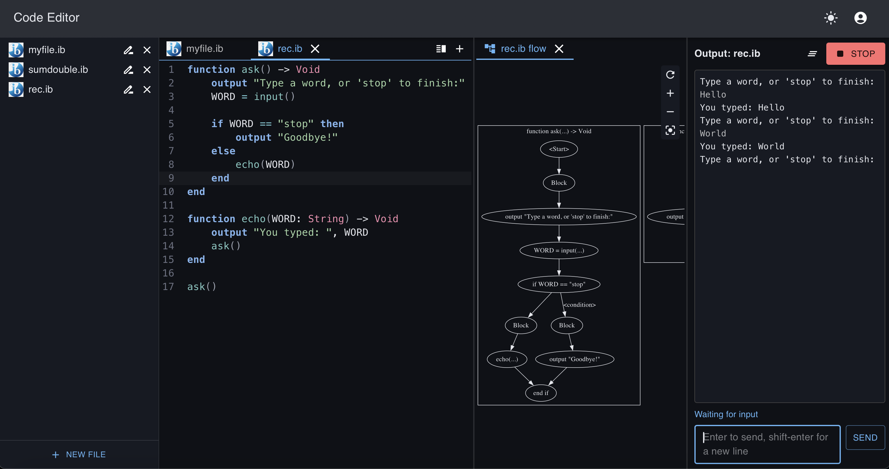
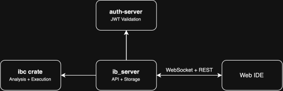

# IB Lang

IB Lang is a web-based programming environment built around a custom language toolchain implemented according to the IB pseudocode language specification used in the IB Computer Science curriculum.

While tools exist for executing IB pseudocode, this project provides a complete environment for developing IB pseudocode programs, with semantic and type analysis, diagnostics and runtime errors, context-aware code completion, and an IDE built to accommodate those capabilities.

The project now consists of a Rust analysis toolchain and execution runtime, an authentication backend, an analysis and execution backend, a landing and documentation page, and a browser-based IDE. [Try IB-Lang online!](https://iblang.on.accelley.com).



### Language Toolchain

The `ibc` crate carries the language from source to analysis to execution. 

Source code first passes through a lexical analyzer and a parser to produce an Abstract Syntax Tree. The binder module then resolves symbols and performs type checking. An additional control-flow analyzer builds a control-flow graph and analyzes function returns. Programs can then be executed through the evaluator module, which is bounded by resource limits. The evaluator supports interactive input, cancellation, and runtime errors.

The language supports typed variables, functions, recursion and mutual recursion, and built-in data structures including arrays, collections, stacks, and queues.

### Web IDE

 - **Architecture.** The browser-based IDE is built in React with CodeMirror and Lezer grammars for syntax highlighting and indentation. It ships as a static single-page app, reaching the backend over a REST API for analysis and file storage and a WebSocket for execution.

 - **Semantic analysis and code completion.** The IDE performs simpler on-client analysis for code completion and continuously communicates with the backend to check for syntax and type errors while the user writes code. Runtime errors and other diagnostics retain their source locations and are displayed in the editor.

 - **Control-flow visualization.** The IDE can also visualize control-flow graphs. Graphs are rendered in the browser using Graphviz compiled to WebAssembly and update as the source changes.

 - **Interactive program execution.** Program execution is handled through a persistent WebSocket connection with the backend, allowing programs to request and receive input interactively and display output throughout the execution process.

 - **Persistent workspaces.** Users can create and manage server-hosted files, which are automatically saved as they are edited. Open tabs and editor layout also persist across sessions.

 - **Split editing.** The editor supports multiple tabs and two side-by-side editor panes. Tabs can be reordered and moved between panes by dragging.

### Architecture

The architecture is split into independent components with the language implementation separated from the web infrastructure. The `ibc` crate exposes analysis + execution modules and can be used as a standalone CLI tool, while the `ib_server` consumes these functions and runs a Tokio-based RESTful API server and a WebSocket server. Authentication lives in the `auth-server`, which was separated from `ib_server` as Firebase doesn't have a Rust admin SDK for `ib_server` to consume, and verifying JWTs manually would mean pulling Google's rotating public keys.



The project currently exposes its analysis backend using a smaller application-specific API rather than implementing the full Language Server Protocol. Microsoft's LSP was considered in early development, but implementing the protocol would introduce complexity while the project's only client was its own Web IDE.

### Building and Running

The toolchain and backend need Rust 1.81 or newer. The auth server, the IDE, and the documentation site need Node 22 or newer. Each part runs independently:

```sh
# analysis and execution backend, on port 8080
cd core/ib_server && cargo run

# JWT verification, on port 8081
cd auth-server && npm ci && npm start

# web IDE, on port 3000/app
cd ide-web && npm ci && cp .env.example .env.development.local && npm start

# landing page and documentation, on port 3001
cd landing && npm ci && npm start -- --port 3001
```

The `ib_server` reads `AUTH_BACKEND_URL` from `core/ib_server/.env` and keeps an SQLite database and the users' files in a `data` directory beside it. The IDE reads the backend's addresses from `.env.development.local`.

Run `cargo test` in `core` for the analyzer, evaluator, and server tests, and `npm test` in `ide-web` for the IDE.

### Deployment

`deploy/` holds a Caddyfile and a Compose file that run the whole project on a single host. Caddy terminates TLS, serves the documentation and landing site at `/` and the IDE at `/app`, and passes `/api` and `/wss` to `ib_server`; it is the only container that publishes ports, so the analysis backend and the auth server are reachable only from inside the Compose network. Both containers are capped in memory and CPU, since users can run their own programs on the machine.

The two static sites are built beforehand and served from the host:

```sh
cd ide-web && npm run build
# copy build/ to /srv/ide-web

cd landing && npm run build
# copy build/ to /srv/landing

docker compose -f deploy/docker-compose.prod.yml up -d --build
```

User files and the database live in the `ib-data` volume, consider backing up this volume.

### Documentation

The language and IDE documentation is the Docusaurus site in `landing/`, with the pages themselves in `landing/docs`. It is published alongside the IDE at [iblang.on.accelley.com](https://iblang.on.accelley.com).
