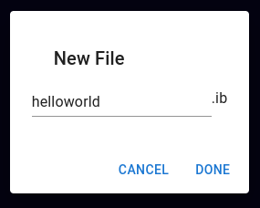

# Introduction

Welcome to the **IB Pseudocode Web IDE**—your ultimate tool for running and managing IB pseudocode projects.

## Getting Started

Getting started is simple! Click the **Launch App** button on the landing page or go directly to [https://ib-web-ide.firebaseapp.com/](https://ib-web-ide.firebaseapp.com/).

Log in using your Google or GitHub account, or create a new account with your email and password—it’s quick and secure.

## Creating a New File

When you first open the app, you’ll see a popup:


Click the **Create New File** button to open the following prompt, where you can name your file:



Simply enter your desired filename (no need to add the `.ib` extension). Note that dots in filenames are not allowed for security reasons. Once you’re done, click **Done**, and your file will be created, automatically synced, and ready to use. The app ensures your progress is saved even if you close the editor.

Your new file will appear in the editor and in the left sidebar. You’re now ready to start coding!

## Writing Code

The editor works just like any other code editor. To get started, try writing this simple program:

```
output "Hello, World!"
```

Run your code by clicking the **Run** button on the right-hand side. The output will appear in the text field below the editor.

Congratulations, you’ve just executed your first IB pseudocode program! Now that you’re familiar with the basics, head to the next section to learn more about IB pseudocode syntax and advanced features.
