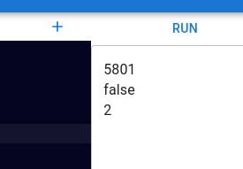

# Input and Output

This section provides a detailed overview of how to use the `output` statement to display information and how the `input` function (once implemented) will enable user interaction in IB Pseudocode.

## Output: Displaying Information

To print information to the standard output, you use the `output` statement. This statement accepts objects of any type and evaluates them before displaying the results in the output console. Below are some examples:

```python
output "Hello, World!"
output 1234 + 4567
output false && true
output my_variable
```

Explanation:

 - **String Output**: Prints the string value directly (e.g., `"Hello, World!"`).
 - **Arithmetic Expressions**: Evaluates and prints the result (e.g., `1234 + 4567` outputs `5701`).
 - **Logical Operations**: Evaluates boolean expressions (e.g., `false && true` outputs `false`).
 - **Variable Values**: Displays the value of the variable (e.g., if `my_variable` equals `2`, it outputs `2`).

The output appears in the designated output box, as illustrated below:



## Input: Capturing User Data

:::danger Feature Not Implemented
The `input` function for user input is not currently supported.
:::

When available, the `input` function will allow your program to read user-provided data. The data captured will always be returned as a `String`, which can then be processed as needed. Below is an example of how this feature is expected to function:

```
user_input = input()
output user_input
```

Future Use Case:

This functionality will enable dynamic interaction with users, making it possible to accept input during runtime and respond accordingly within your program. Keep an eye on updates for when this feature becomes available.